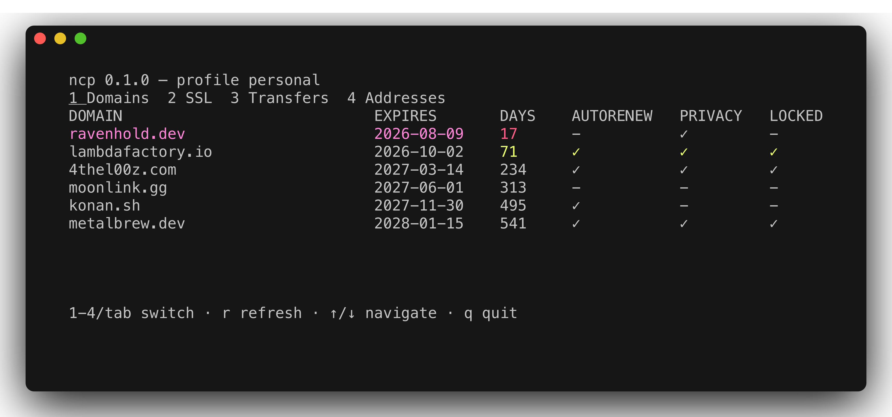
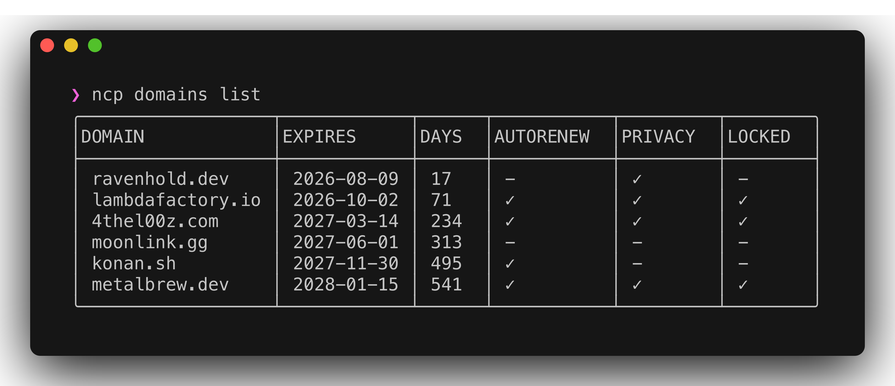
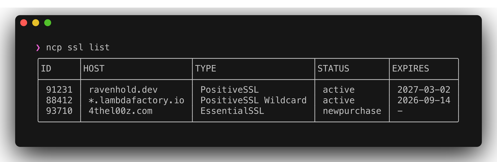
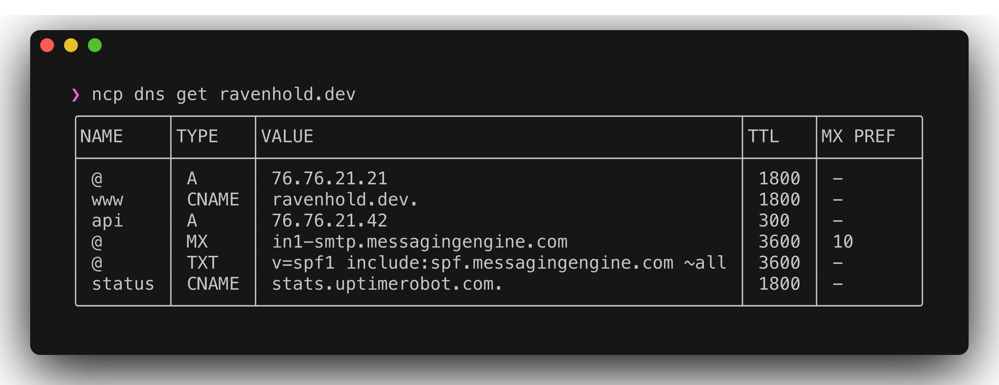
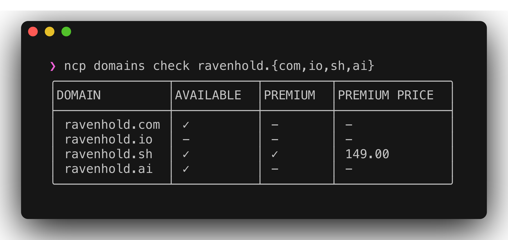
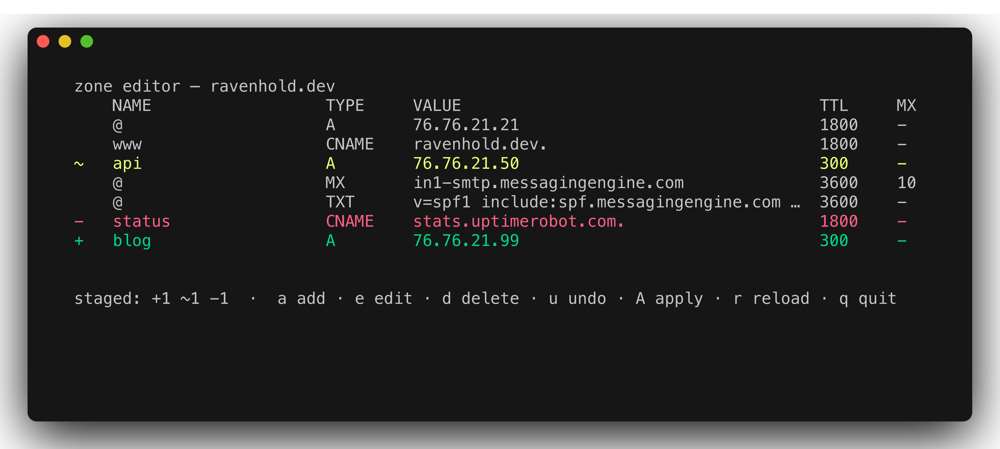
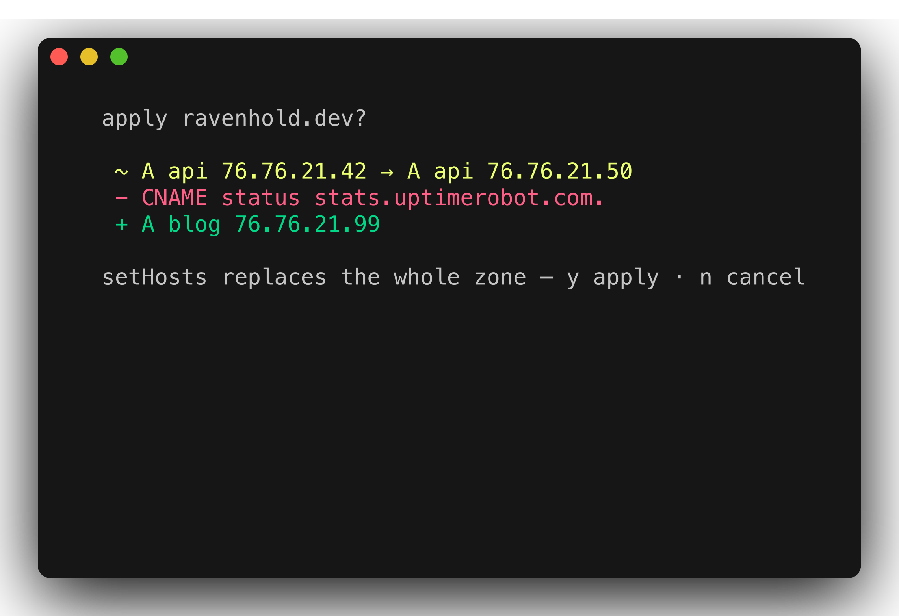

<h1 align="center">ncp</h1>

<p align="center">
  <strong>A fast TUI + CLI for the Namecheap API.</strong><br>
  Domains, DNS, SSL, transfers, privacy — from one binary.
</p>

<p align="center">
  <a href="https://github.com/4thel00z/namecheap-tui/actions/workflows/ci.yml"></a>
  
  <a href="https://charm.sh"></a>
  
</p>

<p align="center">
  
</p>

## Install

```sh
make build   # → bin/ncp (CGo required for libSQL)
```

## Use

```sh
ncp profile add            # interactive — detects your IP, verifies creds
ncp                        # dashboard: domains · ssl · transfers · addresses
ncp domains list --json    # every read command is scriptable
ncp dns edit example.com   # staged zone editor
```

<p align="center">
  
  
</p>
<p align="center">
  
  
</p>

## The zone editor

Stage adds, edits, and deletes — `A`pply shows the full diff first.
Namecheap's `setHosts` replaces the whole zone, so ncp merges your changes
onto a fresh fetch; a single-record edit can never wipe the rest.

<p align="center">
  
  
</p>

DNS as code:

```sh
ncp dns export example.com > zone.yaml
ncp dns import example.com -f zone.yaml
```

## Commands

| Tree | Commands |
|---|---|
| `profile` | `add` `list` `use` `rm` |
| `domains` | `list` `check` `info` `register` `renew` `reactivate` `tlds` `lock` `contacts` |
| `dns` | `get` `add` `rm` `import` `export` `use-default` `use-custom` `emailfwd` `edit` |
| `ns` | `create` `update` `delete` `info` |
| `transfer` | `create` `status` `list` |
| `ssl` | `list` `create` `activate` `info` `renew` `reissue` `approvers` `revoke` |
| `privacy` | `list` `enable` `disable` `renew` `change-email` `assign` `unassign` |
| `account` / `address` | `balance` `pricing` / `list` `info` `add` `edit` `rm` `default` |
| `config` | `get` `set` `sync` |

Global flags: `--profile` · `--json` · `--no-cache` · `--sandbox` — completions via `ncp completion <shell>`.

## Config

- Everything lives in `~/.config/ncp/ncp.db` (libSQL, `0600`).
- Set `TURSO_DATABASE_URL` + `TURSO_AUTH_TOKEN` → embedded replica, `ncp config sync` pushes/pulls.
- Env creds beat stored profiles: `NAMECHEAP_API_KEY` `NAMECHEAP_API_USER` `NAMECHEAP_CLIENT_IP` (`NAMECHEAP_SANDBOX=1`, `NCP_PROFILE`).

## Architecture

```
cmd/ncp            composition root (fang + wiring)
internal/core      pure domain + ports + services (no I/O)
internal/adapters  namecheap XML client · turso store · cli · tui
```

`core` imports stdlib only; adapters never import each other. API calls are
throttled to Namecheap's published limits; reads are cached
(stale-while-revalidate in the TUI).

## Development

```sh
make check         # fmt + lint + test (race)
make hooks         # pre-commit + conventional-commit msg hook
make screenshots   # regenerate assets/ (tmux + freeze, no creds needed)
```

Conventional commits drive release-please; releases ship native CGo binaries
for linux/darwin, amd64/arm64. Design docs: `docs/superpowers/`.
